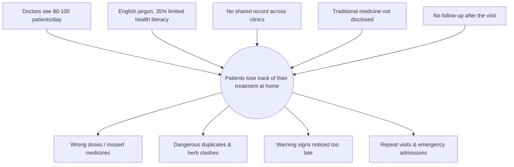
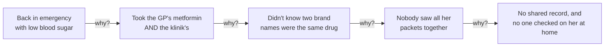
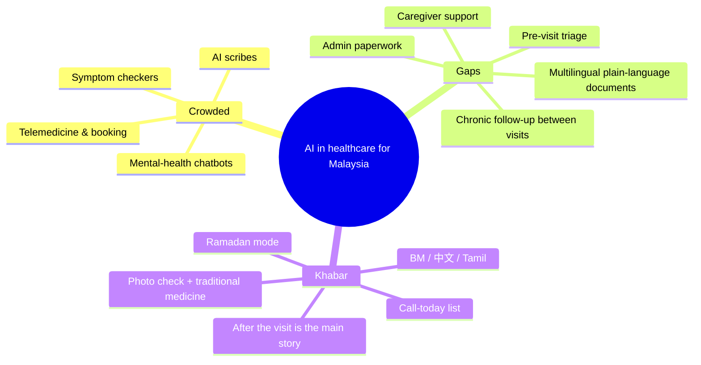
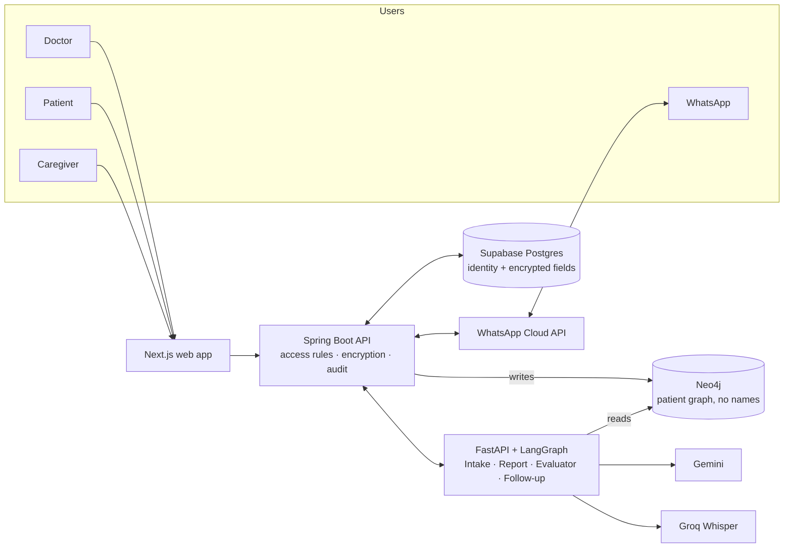

# Khabar by [Team Name]

> **Apa khabar? · 你好吗? · நலமா?**
> AI aftercare for Malaysian clinics: patients understand their treatment in their own language, and the clinic knows who is slipping before they end up back in the queue.

**Team:** [Your Name] (solo)
**Problem Statement:** Self-defined, SDG 3 (Good Health and Well-being): patients lose track of their treatment once they leave the clinic.
**Video Presentation:** [Unlisted YouTube link: to be added after recording, ~9 Oct 2026]
**Presentation Slides:** [Public link: to be added, ~9 Oct 2026]
**Live demo (Vercel):** [khabar-landing-six.vercel.app](https://khabar-landing-six.vercel.app) (the app screens: landing page, doctor sign-in, triage desk and more)
**Code:** [github.com/tanhongsheng050204-code/KHABAR-HEALTHCARE](https://github.com/tanhongsheng050204-code/KHABAR-HEALTHCARE)

> ⚠️ **Status:** in development (practice build, Sep–Oct 2026). The backend foundation is built and tested; the sign-in and triage desk screens work with it locally, the other screens are clickable mock-ups. All patient data is **fake**. Khabar is **not a medical device** and is not for clinical use. Full plan: [plan.md](plan.md).

---

## 1. Project Overview

### The Problem
Malaysian clinic patients leave with instructions they often can't follow, and nobody checks on them until something goes wrong.

**Causes, as we understand them**
- **No time to explain.** Doctors in understaffed public clinics see 80–100 patients a day.
- **Instructions people can't use.** Summaries and prescriptions come in English clinical jargon, while **35% of adults** have limited health literacy (NHMS 2019), and most of them are older adults.
- **Nobody follows up.** Adherence among chronic-disease patients is around **50%**, and only **34%** for type 2 diabetes.
- **Fragmented care.** There's no shared health record, so medicines from a GP, a klinik kesihatan and a specialist are never cross-checked. **46%** of urban older adults take many medicines at once.
- **Hidden traditional medicine.** **69.4%** of Malaysians use traditional or complementary medicine, and patients often don't tell their doctor.
- **Families carry the care.** **79.6%** of older Malaysians depend on their children, but those children are rarely kept informed.

**Stakeholders**
- Patients, especially older, multilingual and chronically ill ones
- Family caregivers
- Clinic doctors and staff at SME and public clinics
- Clinic owners, who carry the cost of repeat visits and lost patients

**What already exists, and why it falls short**
| Existing solution | What it does | Where it falls short |
|---|---|---|
| **CliniFlow AI** (UM Hackathon 2026 champion) | End-to-end clinic workflow: AI intake, AI report drafting with safety checks, patient summary on WhatsApp | Stops at one WhatsApp message after the visit. The summary appears to be English only. No follow-up afterwards. |
| **Memora Health** (US, now part of Commure) | AI text-message follow-up after discharge, with escalation to nurses | Built for US hospital systems over SMS in English. Not available for Malaysian clinics, WhatsApp, or BM, Chinese and Tamil. |
| **PULIH by AstraZeneca** (Malaysia) | Patient-support app with medication reminders | Tied to one company's support programme. Its description mentions no follow-up by the clinic and no alerts sent to the clinic. |
| **DoctorOnCall / BookDoc** (Malaysia) | Online consultations, pharmacy, booking | Focused on getting care, not on what happens after the patient goes home |

### Our Solution
Khabar is an AI platform for Malaysian clinics that follows the patient home. It takes over the clinic workflow CliniFlow showed works (AI intake, AI-drafted reports and a hard safety gate). The main story, though, is afterwards:
- a plain-language summary in the patient's own language;
- 30 days of WhatsApp check-ins that notice when something goes wrong;
- a daily list telling the clinic whom to call.

Khabar never gives new medical advice. It relays what the doctor decided and escalates anything worrying to a human.

**Features**
- **Before the visit:** self-booking; AI intake chat that uses the patient's history; pre-visit report for the doctor; **"show me everything you take"** photo check covering packets from other clinics, supplements, jamu and TCM
- **During the visit:** the doctor speaks or types while the AI drafts the report; a **safety review with 8 checks**; critical findings **cannot be finalised** without a written reason
- **After the visit:** summary in **BM, English, Chinese or Tamil**, sent on WhatsApp, optionally as a **voice note**; **family caregiver access** with consent; **Ramadan fasting mode**
- **Follow-up (days 1–30):** check-ins; **two-way replies with red-flag alerts**; the clinic's **"call these patients today"** list; optional blood-pressure and glucose readings via Favoriot IoT
- **Privacy:** access rules, encrypted sensitive fields, no names sent to the AI, and a **"who viewed my record"** log for patients

---

## 2. Ideation & Process

### 2.1 Ideas We Considered
Chosen ideas are listed first.

| Idea | Why it was kept / dropped |
|---|---|
| **A (Chosen)** Clinic workflow with "after the visit" as the main story | Market research found crowded spaces before and during the visit (scribes, booking, telemedicine), but almost nobody follows the patient home in Malaysia |
| **B (Chosen)** Summaries in BM, English, Chinese and Tamil | Research shows plain-language rewrites improve understanding, but AI translation still lags for non-English languages. Malaysia is multilingual. |
| **C (Chosen)** Two-way WhatsApp follow-up with red-flag alerts | About 50% adherence. WhatsApp is where Malaysian patients already are. Memora proved the model in the US. |
| **D (Chosen)** "Call these patients today" list for the clinic | Gives the paying customer (the clinic) a reason to adopt it |
| **E (Chosen)** "Show me everything you take" photo check | Fragmented records plus 69.4% traditional-medicine use means dangerous duplicates and herb clashes go unseen |
| **F (Chosen)** Family caregiver access, with consent | 79.6% of older Malaysians rely on their children |
| **G (Chosen)** Ramadan fasting mode | About 90% of Malaysians with type 2 diabetes fast, and low-blood-sugar risk rises |
| **H (Chosen)** Layered privacy + "who viewed my record" | Health data is sensitive personal data under PDPA. Visible audit builds trust. |
| **I (Chosen)** Malaysian brand-name to generic drug mapping | Patients hold packets with local brand names, and interaction data uses generic names |
| **J (Chosen, stretch)** Voice-note summaries | Helps low-literacy and low-vision patients. Stretch goal. |
| **K (Chosen, stretch)** Blood-pressure and glucose readings via Favoriot IoT | Useful for chronic follow-up. Stretch goal. |
| L. AI scribe as the main product | Most crowded category in health AI. Kept only as a supporting step during the visit. |
| M. Generic symptom-checker chatbot | Crowded (Ada, K Health) |
| N. Mental-health chatbot | Crowded (Naluri, Wysa) and under regulatory scrutiny |
| O. X-ray or image diagnosis model | Counts as a regulated medical device (MDA), and can't be validated in a hackathon |
| P. Admin and insurance paperwork automation | Needs real documents and integrations. Weaker patient-impact story. |
| Q. Standalone caregiver app / triage tool / document explainer | Merged into Khabar as F, the intake chat, and B |
| R. Straight rebuild of CliniFlow | No identity of its own. We borrowed its patterns and changed the main story instead. |
| S. True end-to-end encryption (only the patient's code unlocks data) | Would break the AI agents, safety checks and follow-ups, and a lost code means a lost history. Replaced by H. |
| T. Let the AI judge drug interactions | An AI checking an AI with no ground truth. We use the DDInter interaction database instead. |
| U. DeepSeek / Qwen as the main LLM | Data would cross borders to China, a PDPA question in a health product |
| V. Qwen3-ASR / Voxtral for transcription | Neither supports Malay or Tamil |
| W. WhatsApp links that open a pre-filled chat | Can't automate the 30-day follow-up |
| X. SMS login codes | Needs a paid SMS provider. Email codes are free and anyone can test them. |
| Y. Native mobile app | App-store friction. A web app installable on phones gives the same result. |
| Z. Names "Pulih" and "Nalam" | Already used by existing health apps |

### 2.2 Ideation Boards

**Problem tree:** what goes wrong once a patient leaves the clinic.

*Five root causes lead to one core problem. Khabar's features map one-to-one onto the causes.*

**5 Whys:** why did Mak Cik Aminah end up back in emergency?

*This chain produced two features: the photo check and the 30-day follow-up.*

**Idea map:** how the market gaps became Khabar.

*We began by sorting health-AI ideas into crowded and underserved, then merged four of the gaps into one product.*

### 2.3 Mentor Consultation
| Date | Mentor | Feedback Received | What Was Changed |
|---|---|---|---|
| — | — | *No mentor sessions yet. This table will be filled in after each session.* | — |

---

## 3. Design & Prototype

**Live app screens:** [khabar-landing-six.vercel.app](https://khabar-landing-six.vercel.app) opens the landing page; [/index.html](https://khabar-landing-six.vercel.app/index.html) links every screen. They are clickable mock-ups with fictional data. The public site runs in demo mode; run the backend locally and the sign-in and triage desk show live data ([how](docs/FRONTEND.md#live-data-sign-in-and-triage-desk)). The source is in [docs/](docs/FRONTEND.md).

An earlier interactive landing page (language switch, medicine scan, reply triage, safety gate) is in [prototype/khabar-landing.html](prototype/khabar-landing.html); open the file in a browser to try it.

| Screen | File | What it shows | Status |
|---|---|---|---|
| Landing page | `docs/landing_page.html` | The product story, dialect voice demo, kitchen-table medicine case | Mock-up |
| Doctor sign-in | `docs/login.html` | Clinic staff sign-in | **Works with the local API** (demo doctor); Supabase sign-in next |
| Triage desk | `docs/clinic_command.html` | Patients ranked by urgency, with one-tap actions | **Live call list from the local API** (most urgent first, mark as called); sample cases below it |
| Reply console | `docs/telemetry_chat.html` | A patient's replies and the clinic's responses | Mock-up; reply triage built in the agents service |
| Medicine clash radar | `docs/polypharmacy_guard.html` | Duplicates and clashes across clinics and pharmacies | Mock-up; safety checks built in the agents service |
| 30-day recovery view | `docs/recovery_arc.html` | Check-in stages and Ramadan timing | Mock-up |
| Audit log | `docs/moh_audit_logs.html` | Who opened which record, and why | Mock-up; "who viewed my record" built in the API |
| Full walkthrough | `docs/khabar_full_prototype.html` | Step-by-step demo of the whole journey | Mock-up |
| Patient intake chat | — | Adaptive pre-visit questions in the patient's language | API built; screen planned |
| Patient summary on WhatsApp | — | Medicines, times, doses and warning signs in BM, English, Chinese or Tamil | Planned |

---

## 4. What Makes It Different

| Feature | What's new about it |
|---|---|
| **After the visit is the product** | Most clinic AI ends at the visit. Khabar's value is days 1–30. |
| **Summaries and check-ins in BM, English, Chinese and Tamil** | Built for how Malaysian patients actually read and talk, including Manglish replies such as *"pening sikit"* |
| **Red-flag triage that errs towards alerting** | A reply counts as urgent if **either** a doctor-approved keyword list **or** the AI flags it. The AI never invents advice. |
| **"Show me everything you take"** | Cross-checks packets from *other* clinics and **traditional medicine**, which Malaysian patients use heavily and rarely disclose |
| **Ramadan fasting mode** | Reminders move to sahur and berbuka, and check-ins ask about low-blood-sugar symptoms. Doses stay the doctor's decision. |
| **Safety checks based on data, not AI opinion** | Interaction, allergy, dose, duplicate and herb checks use databases and rules. A critical finding is blocked in the UI, the API **and** the database. |
| **"Who viewed my record"** | Patients can see who opened their data, which clinic software rarely offers |

| | CliniFlow AI | Memora Health | PULIH (AstraZeneca) | **Khabar** |
|---|---|---|---|---|
| Clinic workflow (intake → report → safety) | ✅ | — | — | ✅ |
| Follow-up after the visit | One WhatsApp message | ✅ SMS, US | Medication reminders | ✅ 30 days, two-way |
| BM / Chinese / Tamil | — | — | — | ✅ |
| Red-flag alerts to the clinic | — | ✅ | — | ✅ |
| Traditional-medicine and other-clinic check | — | — | — | ✅ |
| Ramadan mode | — | — | — | ✅ |
| Patient-visible access log | — | — | — | ✅ |

*— = not mentioned in the public material we reviewed.*

---

## 5. Technical Architecture & Feasibility

### Tech stack
| Layer | Choice | Why | Constraints we expect |
|---|---|---|---|
| Frontend | Now: static HTML screens with Tailwind. Next: **Next.js** web app, installable on phones | One codebase for doctor, patient and caregiver; judges can open a link instantly; the camera works in the browser | The current screens use hard-coded data and Tailwind's CDN build, which is not meant for production |
| Clinical backend | **Spring Boot** (Java) | Strong typing and structure for clinical data, access checks and encryption. It's the only service that holds the encryption key. | Steep learning curve (first backend) |
| AI service | **FastAPI + LangGraph** (Python) | Four agents with explicit control flow (Intake, Report, Evaluator, Follow-up). Python has the best AI libraries. | A second language and service to deploy |
| Database and logins | **Supabase** (Postgres + Auth) | Free tier, built-in email one-time codes, row-level security | Free projects pause when idle; we'll upgrade before demos |
| Patient graph | **Neo4j AuraDB** | Multi-step questions like "which drugs, from which clinic, clash with which herb" are natural in a graph. It stores no names. | The free database pauses when idle |
| LLM | **Gemini** (free tier), swappable | Low cost, multilingual, can also read photos | On the free tier Google may use the data, which is acceptable only because all data is fake. The final pick depends on a planted-error test. |
| Transcription | **Groq Whisper large-v3-turbo** | ~US$0.04 per hour of audio; supports Malay and Tamil | Accuracy on drug names in Manglish; confirmed by a 5-recording test |
| Messaging | **WhatsApp Cloud API** (Telegram fallback) | Where Malaysian patients already are | The test number reaches only 5 phones. Messages the clinic starts need templates approved by Meta. |
| Drug data | **DDInter 2.0** + our own brand-name and herb tables | Free, peer-reviewed interaction data | Non-commercial licence (CC BY-NC-SA 4.0). Brand names have to be mapped by hand. |
| IoT (stretch) | **Favoriot** | Malaysian IoT platform with a REST API | Free tier unconfirmed |
| Hosting | One Vercel project for the app ([live](https://khabar-landing-six.vercel.app)) and another in Singapore for the two backend services, the API as a container and the agents as a Python service ([browse the API](https://khabar-api.vercel.app/docs)), with a Supabase Postgres database | Free tier, one place to deploy, low latency from Malaysia | The backend sleeps after five idle minutes, so the first request takes about 15 seconds; a paid plan or a small always-on container removes that before demos |

### System architecture diagram

**Rules the architecture enforces:**
1. The agents never see names or IC numbers, and never touch Postgres.
2. Only Spring Boot holds the encryption key.
3. Safety checks use databases and rules wherever they exist.
4. A critical finding is blocked in three separate places: UI, API and database.

### Build plan & scope
We're one builder, so the scope is tiered. **Tier 1 alone is a complete, demonstrable product.**

| Tier | What's built | Status |
|---|---|---|
| **Tier 1: committed** | Logins and access rules · AI intake chat and pre-visit report · AI report drafting · the 8 safety checks, with critical findings blocked in UI, API and database · multilingual summary on WhatsApp · 30-day check-ins · two-way red-flag triage · clinic "call today" list · no names sent to the AI · 30 fake patients · demo clock | In progress, target 28 Sep 2026 |
| **Tier 2: planned** | Photo check (other clinics and traditional medicine) · caregiver access · Ramadan mode · field encryption · "who viewed my record" · self-booking | In progress, target 28 Sep with overflow until 4 Oct |
| **Tier 3: stretch** | Voice-note summaries · speaking instead of typing during the visit · Favoriot readings · learning each doctor's writing style | Only if Tiers 1–2 are done |

If time runs short, features are dropped in reverse order of the tiers. The full day-by-day schedule, checkpoints and demo script are in [plan.md](plan.md).

**Built so far** (313 automated tests passing: 152 in the agents service, 161 in the API):

| Part | Done | Still to do |
|---|---|---|
| Sign-in and access | Supabase token checks; doctor, patient and caregiver access rules; revoked caregiver consent blocks access at once; the sign-in screen signs in to the local API | Real Supabase sign-in on the screen |
| Onboarding | The clinic registers a patient and hands over a one-time code that links the patient's sign-in to their record; patients invite and remove caregivers; doctors invite colleagues; a bootstrap token creates the first clinic. Codes are stored hashed and expire after 7 days | Sign-up screens |
| Privacy | IC, phone, notes, replies, summaries, intake chats, medication lists and booking reasons stored encrypted; the patient's name, IC and phone removed before anything reaches the AI; "who viewed my record" log | Name removal for other people mentioned in a message |
| Before the visit | Self-booking from a rolling calendar (the database refuses double bookings); intake chat that confirms what the clinic already knows; the pre-visit page (intake, last visit, the medicine list checked for duplicates across clinics, clashes, herbs and allergies, replies since); a "what I take" list kept by the patient, caregiver or clinic | Photo check of medicine packets (left out on purpose: labels carry names) |
| The visit | The visit screen (`docs/visit.html`) on real data: shorthand notes or speech to text (Groq Whisper) turned into a structured draft; overrides need a written reason and are audited; finalising is blocked in three places: the screen, the API and a database rule | Learning each doctor's writing style |
| Safety checks | Allergy (including allergies told at intake), drug interaction, duplicate medicine across clinics and brands, herb clash, dose limit, pregnancy, invented drugs, invented symptoms, missing report fields, unrecognised drug. The planted-error set of ten known mistakes is a test and all ten are caught | Pharmacist review of dose limits and evidence before real use |
| Summary | Plain-language summary in BM, English, Chinese and Tamil, with sahur and berbuka timings when fasting; sent through an approved WhatsApp template when the visit is finalised | Voice-note version |
| Follow-up | Check-ins on days 1, 3, 7, 14 and 30 (a fasting version during Ramadan); replies by WhatsApp (signature checked) or the app; triage in four languages by word lists plus an optional model check; patients hear back only in approved words (fixed 999 advice for red flags, the doctor's approved answers, or an acknowledgement); missed doses noticed; home blood pressure and blood sugar from the app or a Favoriot-linked device; the call list ranks red flags, readings, missed doses and silence | A live test with approved WhatsApp templates and a real Favoriot device |
| Running it | Both services and the screens run locally with no accounts (`scripts/run-local.ps1`, `local` mode with 30 demo patients and a clock you can fast-forward). Everything is also live: the app on Vercel, the API and agents in a Vercel project in Singapore with a Supabase database, and every endpoint browsable at [/docs](https://khabar-api.vercel.app/docs) | Connecting the deployed services to AuraDB |
| Patient graph | Spring Boot writes each patient's conditions, allergies, medicines (with brand and generic), herbs, visits, warning symptoms and readings to Neo4j under a random graph ID only, after every change; the agents read it read-only for intake, the safety check and follow-up triage. Tested against a real in-process Neo4j, with a test that no name, IC or phone reaches it. Off when `NEO4J_URI` is empty | An AuraDB instance for the live demo |

## Repository layout
| Folder | What's in it |
|---|---|
| [plan.md](plan.md) | The full plan, schedule and decisions |
| [docs/](docs/FRONTEND.md) | App screens (HTML, deployed on Vercel), frontend rules, design brief, daily `EXPLAIN.md` |
| [prototype/](prototype/) | The earlier interactive landing page (no longer deployed) |
| [services/](services/README.md) | Backend: `api/` (Spring Boot) and `agents/` (FastAPI). The README there explains how to run and test them |
| [infra/](infra/) | Docker Compose and the environment variable template |

**How we'll measure it:** a patient-understanding test with 5 people, comparing an English-only summary against a Khabar summary in the reader's own language. We'll report it honestly as a small pilot.

---

## Credits & Declarations
- **Inspiration:** CliniFlow AI (UM Hackathon 2026 champion), for the clinic workflow and the safety-gate pattern.
- **Drug interaction data:** DDInter 2.0 (*Nucleic Acids Research*, 2025), licensed CC BY-NC-SA 4.0. The local checker uses a generated subset for its demo generics; see [`services/agents/scripts/import_ddinter.py`](services/agents/scripts/import_ddinter.py) and [`services/agents/data/ddinter_interactions.json`](services/agents/data/ddinter_interactions.json). Source: [DDInter downloads](https://ddinter.scbdd.com/download/).
- **External services:** Google Gemini, Groq, Meta WhatsApp Cloud API, Supabase, Neo4j AuraDB, Vercel, Favoriot.
- **AI tools used in development:** Claude Code (Anthropic) for planning, research, the backend services and the Vercel landing page; Google Antigravity for the app screens in `docs/`. All AI-written code is reviewed, and explained in [docs/EXPLAIN.md](docs/EXPLAIN.md).
- **Data:** all patient data in this repository is fake. No real patient data is used or stored.

### Sources
[NHMS 2023 (CodeBlue)](https://codeblue.galencentre.org/2024/05/over-two-million-adults-in-malaysia-live-with-three-ncds-nhms-2023/) · [Malaysian health literacy](https://www.ncbi.nlm.nih.gov/pmc/articles/PMC8197907/) · [Medication adherence in Malaysia](https://pubmed.ncbi.nlm.nih.gov/42584433/) · [Polypharmacy in older Malaysians](https://journals.plos.org/plosone/article?id=10.1371%2Fjournal.pone.0173466) · [Traditional medicine & drug problems (meta-analysis)](https://pmc.ncbi.nlm.nih.gov/articles/PMC7996557/) · [Ramadan & diabetes in Malaysia](https://www.ncbi.nlm.nih.gov/pmc/articles/PMC3253336/) · [UNDP: older persons in Malaysia](https://www.undp.org/malaysia/blog/navigating-future-care-older-persons-malaysia-2040-community-support-technological-integration) · [Doctor workload (Focus Malaysia)](https://focusmalaysia.my/malaysias-healthcare-system-is-under-strain-and-reforms-cannot-wait/) · [AI vs professional translation of discharge instructions](https://pubmed.ncbi.nlm.nih.gov/40960827/) · [Bessemer: State of Health AI 2026](https://www.bvp.com/atlas/state-of-health-ai-2026) · [Memora Health](https://www.memorahealth.com/) · [PULIH by AstraZeneca](https://play.google.com/store/apps/details?id=com.astrazeneca.pulih&hl=en) · [DDInter 2.0](https://academic.oup.com/nar/article/53/D1/D1356/7740584)
