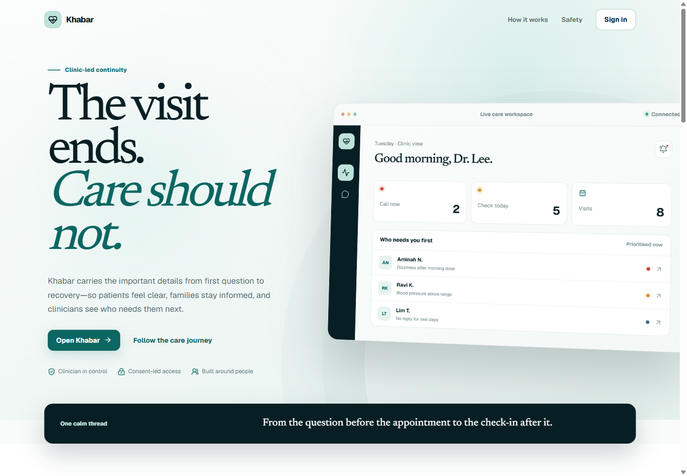
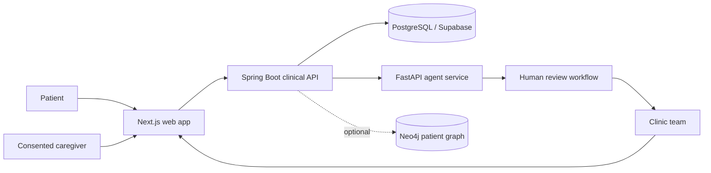

# Khabar

<div align="center">

### Apa khabar? · 你好吗? · நலமா?

**A little more care between clinic visits.**

Khabar is a concept for Malaysian clinics: clear, multilingual aftercare for patients, with a shared follow-up workflow for clinic teams and consented caregivers.

[✨ Explore the live, animated demo](https://khabar-landing-six.vercel.app) · [🩺 Open the API explorer](https://khabar-api.vercel.app/docs) · [🧭 Jump to the project tour](#-take-the-interactive-tour)

[](https://khabar-landing-six.vercel.app)

<sub>Demo screens use fictional data. The live website is the best place to experience its motion and interactions.</sub>

</div>

---

## At a glance

| | |
|---|---|
| **Project** | AI-assisted clinic aftercare concept for Malaysia |
| **People it serves** | Clinic teams, patients, and caregivers invited with patient consent |
| **Core idea** | Turn follow-up replies into a review list for the clinic—not an automated diagnosis |
| **Languages in the concept** | Bahasa Malaysia, English, Chinese, and Tamil |
| **Public demo** | [khabar-landing-six.vercel.app](https://khabar-landing-six.vercel.app) |
| **Project status** | Working prototype and fictional-data demo; not approved for clinical use |

<p align="center">
  <a href="https://khabar-landing-six.vercel.app"></a>
  <a href="https://khabar-api.vercel.app/docs"></a>
  <a href="FUTURE_PLAN.md"></a>
</p>

## ✨ Take the interactive tour

Choose a stop to learn how the concept fits together. Open the live demo for the full animated experience.

<details>
<summary><strong>🏥 For the clinic team — review, prioritize, follow up</strong></summary>

Khabar’s central workflow is a clinic review list. It brings patient replies and follow-up signals into one place so staff can decide whom to contact. The concept is designed to support the care team, not replace its judgment.

Try the [live clinic demo](https://khabar-landing-six.vercel.app), or see the local API and demo instructions in [services/README.md](services/README.md).

</details>

<details>
<summary><strong>💬 For patients — understand the plan and check in</strong></summary>

The product concept pairs plain-language summaries with scheduled check-ins after a visit. Patients can reply in their own words; potentially concerning replies are surfaced for human review. The demo uses fictional patients and does not provide personal medical advice.

</details>

<details>
<summary><strong>🤝 For caregivers — help with permission</strong></summary>

Family support is part of the product direction, with access intended to be explicitly invited and revocable by the patient. Read the [future product plan](FUTURE_PLAN.md) for the proposed phased approach, including privacy and safety considerations.

</details>

<details>
<summary><strong>🛡️ Safety and privacy — human review stays central</strong></summary>

- The public demo uses fictional data; do not enter real patient information.
- Khabar is a prototype, not a medical device, and is not for diagnosis or treatment.
- Alerts are intended to prompt review by a clinic professional, not automatically make clinical decisions.
- AI and external health-data integrations need further validation, privacy review, and operational approval before any real-patient use.

</details>

## 🎬 See it in motion

GitHub renders README Markdown as a document: it supports links and expandable sections, but it does not run custom JavaScript or CSS animations. The animated landing page and its interactive moments live in the [deployed demo](https://khabar-landing-six.vercel.app). The screenshot above is a quick visual preview; click it to explore the full site.

## 🧩 How the prototype fits together



The clinical API is the system of record. The separate Python service hosts agent workflows. Optional graph context is de-identified. The public deployment is a demo environment; this architecture is not a claim of clinical readiness or regulatory approval.

<details>
<summary><strong>🧰 Technology stack</strong></summary>

| Area | Technology |
|---|---|
| Web app | Next.js, React, TypeScript |
| Clinical API | Java, Spring Boot |
| Agent service | Python, FastAPI, LangGraph |
| Data | PostgreSQL / Supabase; optional Neo4j for graph context |
| Deployment | Vercel demo deployments |

Integrations with language models, messaging, and health data have their own consent, provider, reliability, and privacy requirements. They must not be treated as ready for real-patient use merely because a demo path exists.

</details>

## 🚀 Run it locally

The quickest Windows option starts the local demo services:

```powershell
powershell -ExecutionPolicy Bypass -File scripts/run-local.ps1
```

For prerequisites, manual startup, demo accounts, and API details, see [services/README.md](services/README.md). Frontend and live-data notes are in [docs/FRONTEND.md](docs/FRONTEND.md).

## 🗺️ Project guide

| Want to… | Go to |
|---|---|
| See the future product direction and staged feature plan | [FUTURE_PLAN.md](FUTURE_PLAN.md) |
| Check remaining/incomplete work | [UNDONE_WORK.md](UNDONE_WORK.md) |
| Understand the system and recent implementation notes | [docs/EXPLAIN.md](docs/EXPLAIN.md) |
| Run the backend and explore its demo endpoints | [services/README.md](services/README.md) |
| Learn how frontend demo/live data works | [docs/FRONTEND.md](docs/FRONTEND.md) |
| Browse the deployed API | [khabar-api.vercel.app/docs](https://khabar-api.vercel.app/docs) |

## 🧪 Current state

The public landing page and fictional-data demo are online. The codebase also contains local workflows and backend services, but integrations and end-to-end behavior still require further validation. In particular, a functioning prototype is not evidence that clinical operations, provider configuration, privacy controls, or medical safety have been approved for real patients.

See [UNDONE_WORK.md](UNDONE_WORK.md) for known follow-ups and [FUTURE_PLAN.md](FUTURE_PLAN.md) for the proposed direction. When those documents change, keep this overview aligned with the actual implementation.

## 📚 Data attribution

The project includes a demo-sized derived subset of DDInter interaction data. DDInter is distributed under **CC BY-NC-SA 4.0**; see the included dataset/source notices before reuse. That non-commercial license may restrict how this project or derivative data can be used commercially.

---

<div align="center">

**Khabar — care that continues after the visit.**

[Open the animated demo ↗](https://khabar-landing-six.vercel.app)

</div>
