# Khabar by [Team Name]

> **Apa khabar? · 你好吗? · நலமா?**
> AI aftercare for Malaysian clinics. Patients understand their treatment in their own language, and the clinic knows who is slipping before they end up back in the queue.

**Team:** [Your Name] (solo)
**Problem Statement:** Self-defined, SDG 3 (Good Health and Well-being): patients lose track of their treatment once they leave the clinic.
**Video Presentation:** [Unlisted YouTube link: to be added after recording]
**Presentation Slides:** [Public link: to be added]
**UI Prototype (live):** [khabar-landing-six.vercel.app](https://khabar-landing-six.vercel.app), a working app, not a mock-up. Press **Doctor view** or **Patient view** on the sign-in page to explore with fictional data.
**API reference (live):** [khabar-api.vercel.app/docs](https://khabar-api.vercel.app/docs)
**Code:** [github.com/tanhongsheng050204-code/KHABAR-HEALTHCARE](https://github.com/tanhongsheng050204-code/KHABAR-HEALTHCARE)

[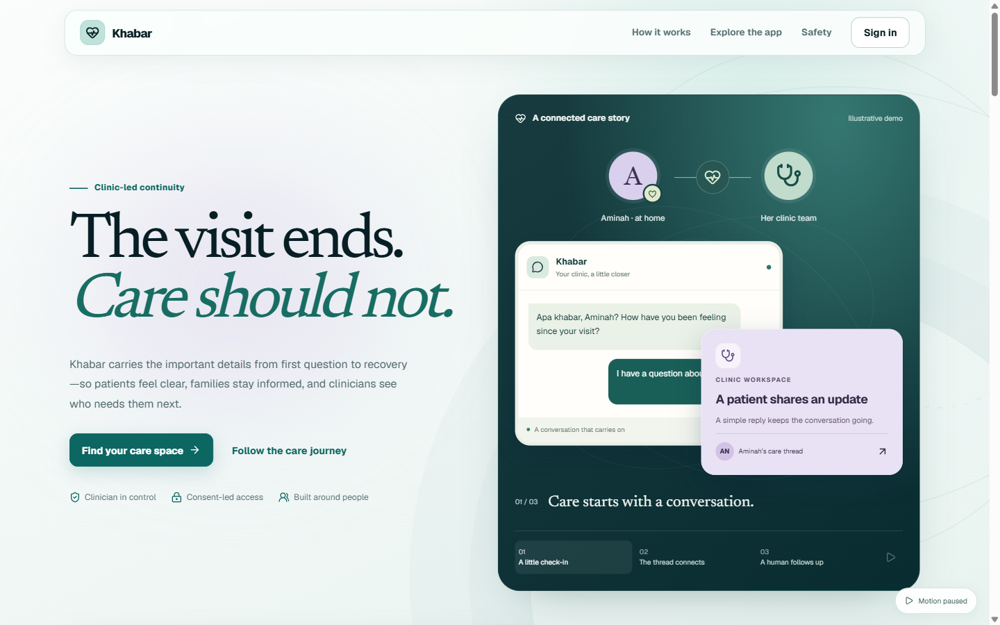](https://khabar-landing-six.vercel.app)

> ⚠️ **Status (25 Sep 2026):** working prototype, deployed. Local verification on 25 Sep reported 226 API tests passing (1 optional PostgreSQL smoke test skipped locally) and 205 agent tests passing; frontend lint, TypeScript, and production build also passed. The public demo has not been redeployed and rechecked against this branch. All patient data is **fictional**. Khabar is **not a medical device** and is not for clinical use. Full plan: [plan.md](plan.md). Open work: [UNDONE_WORK.md](UNDONE_WORK.md).

---

## Contents
1. [Project Overview](#1-project-overview)
2. [Ideation & Process](#2-ideation--process)
3. [Design & Prototype](#3-design--prototype)
4. [What Makes It Different](#4-what-makes-it-different)
5. [Technical Architecture & Feasibility](#5-technical-architecture--feasibility)
6. [Evidence it works](#6-evidence-it-works)
7. [Run it yourself](#7-run-it-yourself)
8. [Credits & Declarations](#8-credits--declarations)

---

## 1. Project Overview

### The Problem
Malaysian clinic patients leave with instructions they often can't follow, and nobody checks on them until something goes wrong. The typical result is a patient like **Mak Cik Aminah**, 64, who takes metformin from the klinik kesihatan *and* the same drug under a different brand name from her GP, adds bitter-gourd juice her sister recommended, and returns to emergency with low blood sugar. No one ever saw all three together.

**Causes, as we understand them**

| Cause | Why it matters |
|---|---|
| **No time to explain** | Doctors in understaffed public clinics see 80–100 patients a day. A rushed explanation is quickly forgotten. |
| **Instructions people can't use** | Summaries and prescriptions come in English clinical jargon, while **35% of Malaysian adults** have limited health literacy (NHMS 2019), most of them older adults. |
| **Nobody follows up** | Medication adherence among chronic-disease patients is around **50%**, and only **34%** for type 2 diabetes. Problems surface only at the next visit, or in emergency. |
| **Fragmented care** | There is no shared record across GP, klinik kesihatan and specialist, so medicines are never cross-checked. **46%** of urban older adults take many medicines at once. |
| **Hidden traditional medicine** | **69.4%** of Malaysians use traditional or complementary medicine, and patients often don't tell their doctor. |
| **Families carry the care, uninformed** | **79.6%** of older Malaysians depend on their children, who are rarely kept in the loop. |

**Stakeholders**
- **Patients:** especially older, multilingual and chronically ill people managing several medicines.
- **Family caregivers:** adult children who help with medicines and appointments.
- **Clinic doctors and staff** at private GP clinics and public klinik kesihatan: they need to know *who* to call, not read every message.
- **Clinic owners:** they carry the cost of repeat visits, no-shows and patients who drift away.
- **The wider system:** avoidable emergency admissions for complications like hypoglycaemia.

**What already exists, and why it falls short**

| Existing solution | What it does | Where it falls short |
|---|---|---|
| **CliniFlow AI** (UM Hackathon 2026 champion) | End-to-end clinic workflow: AI intake, AI report drafting with safety checks, a patient summary on WhatsApp | Stops at one WhatsApp message after the visit. The summary appears to be English only. No follow-up afterwards. |
| **Memora Health** (US, now part of Commure) | AI text-message follow-up after discharge, escalating to nurses | Built for US hospital systems over English SMS. Not available for Malaysian clinics, WhatsApp, or BM, Chinese and Tamil. |
| **PULIH by AstraZeneca** (Malaysia) | Patient-support app with medication reminders | Tied to one company's support programme. No follow-up by the clinic and no alerts to the clinic. |
| **DoctorOnCall / BookDoc** (Malaysia) | Online consultations, pharmacy, booking | Focused on *getting* care, not on what happens after the patient goes home. |

### Our Solution
Khabar is an AI platform for Malaysian clinics that follows the patient home. It keeps the clinic workflow CliniFlow showed works (AI intake, an AI-drafted report and a hard safety gate), then makes the **30 days after the visit** the main story: a plain-language summary in the patient's own language, regular check-ins that notice when something is wrong, and a daily list that tells the clinic whom to call. Khabar never gives new medical advice. It relays what the doctor decided and escalates anything worrying to a human.

**Feature set**

| Stage | Features |
|---|---|
| **Before the visit** | Self-booking from the clinic's calendar · a guided intake chat in the patient's language that already knows their history · a pre-visit page for the doctor · a shared **"everything I take"** list (medicines from every clinic, supplements, jamu, herbs) · reading a **medicine-packet photo**, with consent, into that list |
| **During the visit** | The doctor types shorthand or speaks, and the AI structures it into a draft report · a **safety check** (allergy, interaction, duplicate across clinics and brands, herb clash, dose, pregnancy, invented drugs or symptoms, missing fields) · a **critical finding cannot be finalised** without a written reason, enforced in the screen, the API **and** the database |
| **After the visit** | A summary in **BM, English, Chinese or Tamil**, sent on WhatsApp · **Ramadan fasting mode** (sahur and berbuka timings) · **caregiver access** that the patient grants and can revoke |
| **Follow-up, days 1–30** | Check-ins on days 1, 3, 7, 14 and 30 · two-way replies with **red-flag triage** in four languages · fixed 999 advice for emergencies · home blood pressure and glucose readings (manual, or a Favoriot-linked device) · the clinic's **"who needs you first"** call list |
| **Privacy** | Access rules per role · encrypted sensitive fields · names and IC numbers removed before anything reaches the AI · a **"who viewed my record"** audit trail |

---

## 2. Ideation & Process

### 2.1 Ideas We Considered
Chosen ideas are listed first.

| Idea | Why it was kept / dropped |
|---|---|
| **A (Chosen)** Clinic workflow with "after the visit" as the main story | Market research found the spaces before and during the visit crowded (scribes, booking, telemedicine), but almost nobody follows the patient home in Malaysia. |
| **B (Chosen)** Summaries in BM, English, Chinese and Tamil | Plain-language rewrites improve understanding, and Malaysia is multilingual. AI translation still lags for non-English languages, so wording is constrained to what the doctor approved. |
| **C (Chosen)** Two-way follow-up with red-flag alerts | Adherence is about 50%. WhatsApp is where Malaysian patients already are. Memora proved the model in the US. |
| **D (Chosen)** "Who needs you first" call list for the clinic | Gives the paying customer, the clinic, a daily reason to open the product. |
| **E (Chosen)** "Everything I take" list and packet photo | Fragmented records plus 69.4% traditional-medicine use means duplicates and herb clashes go unseen. |
| **F (Chosen)** Family caregiver access, with consent | 79.6% of older Malaysians rely on their children. |
| **G (Chosen)** Ramadan fasting mode | About 90% of Malaysians with type 2 diabetes fast, and low-blood-sugar risk rises. |
| **H (Chosen)** Layered privacy and "who viewed my record" | Health data is sensitive personal data under the PDPA. A visible audit trail builds trust. |
| **I (Chosen)** Malaysian brand-name to generic mapping | Patients hold packets with local brand names, while interaction data uses generic names. |
| **J (Chosen)** Patient graph in Neo4j (de-identified) | "Which drug, from which clinic, clashes with which herb" is a multi-step question that a graph answers naturally. |
| **K (Chosen, stretch)** Home readings via Favoriot IoT | Useful for chronic follow-up. Built, but shown with simulated readings until a real device is tested. |
| **L (Chosen, stretch, not built)** Voice-note summaries | Helps low-literacy and low-vision patients. First to drop if time runs out. |
| **M (Chosen, stretch, not built)** Learning each doctor's writing style | Nice-to-have. First in the drop order. |
| N. AI scribe as the main product | The most crowded category in health AI. Kept only as a supporting step in the visit. |
| O. Generic symptom-checker chatbot | Crowded (Ada, K Health), and risks giving medical advice. |
| P. Mental-health chatbot | Crowded (Naluri, Wysa) and under regulatory scrutiny. |
| Q. X-ray or image diagnosis model | A regulated medical device (MDA), and impossible to validate in a hackathon. |
| R. Admin and insurance paperwork automation | Needs real documents and integrations. Weaker patient-impact story. |
| S. Standalone caregiver app / triage tool / document explainer | Merged into Khabar as F, the intake chat and B. |
| T. Straight rebuild of CliniFlow | No identity of its own. We borrowed its patterns and changed the main story instead. |
| U. True end-to-end encryption (only the patient's code unlocks data) | Would break the agents, safety checks and follow-ups, and a lost code means a lost history. Replaced by H. |
| V. Let the AI judge drug interactions | An AI checking an AI with no ground truth. We use the DDInter database and written rules instead. |
| W. DeepSeek or Qwen as the main LLM | Data would leave for China, a PDPA question in a health product. |
| X. Qwen3-ASR or Voxtral for transcription | Neither supports Malay or Tamil. |
| Y. WhatsApp links that open a pre-filled chat | Can't automate a 30-day follow-up. |
| Z. SMS login codes | Needs a paid SMS provider. Email codes are free and anyone can test them. |
| AA. Native mobile app | App-store friction. A web app that installs on phones gives the same result. |
| AB. Names "Pulih" and "Nalam" | Already used by existing health apps. "Khabar" comes from *apa khabar?* ("how are you?"), which is exactly what the product asks. |

### 2.2 Ideation Boards

**Problem tree:** what goes wrong once a patient leaves the clinic.
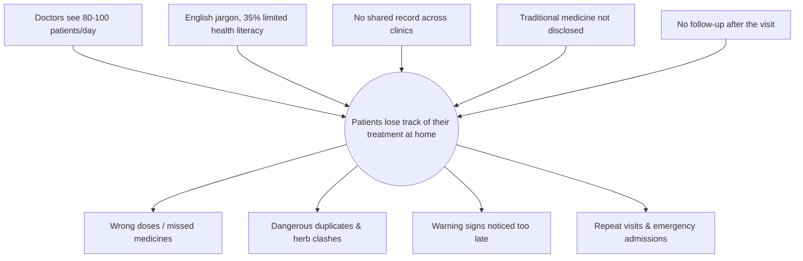
*Five root causes lead to one core problem. Each Khabar feature answers one of the causes.*

**5 Whys:** why did Mak Cik Aminah end up back in emergency?
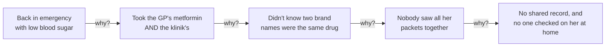
*This chain produced two features: the "everything I take" list with the cross-clinic duplicate check, and the 30-day follow-up.*

**Idea map:** how market gaps became Khabar.
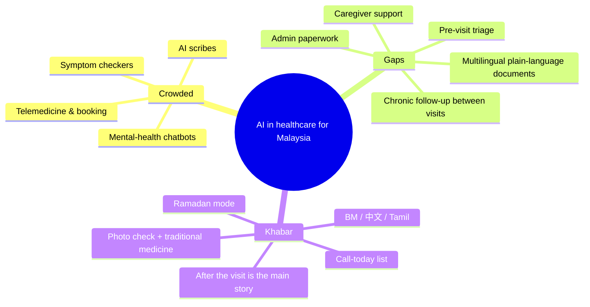
*We sorted health-AI ideas into crowded and underserved, then merged four of the gaps into one product.*

**User flow:** one patient's journey, and where a human always stays in charge.
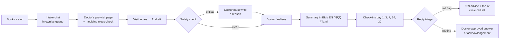
*The AI drafts, structures and sorts. The doctor decides every clinical point, and warning signs always reach a person.*

**Design evolution:** the UI went through three rounds before the current one.

| Round | What it was | What we learned |
|---|---|---|
| 1. Single-page prototype ([prototype/khabar-landing.html](prototype/khabar-landing.html)) | Interactive story: language switch, medicine scan, reply triage, safety gate | The story lands best told through one patient (Aminah) |
| 2. Static screens ([docs/](docs/FRONTEND.md), generated with Antigravity) | Clickable mock-ups of every role | Early drafts invented Ministry of Health badges and named real hospitals; we removed them and set a rule: no real organisations, no fake certifications |
| 3. Next.js app ([web/](web/)) | The real product, wired to the API | Clinic staff need "who first", not dashboards |
| 4. Care-story redesign (24 Sep, [notes](docs/UI_REDESIGN_2026-09-24.md)) | Teal and lavender, calm motion with pause controls, mobile-first patient home | Motion must be pausable; unsent drafts must survive switching sections |

### 2.3 Mentor Consultation
| Date | Mentor | Feedback Received | What Was Changed |
|---|---|---|---|
| — | — | *No mentor sessions yet. This table will be filled in after each session, including feedback we chose not to follow and why.* | — |

---

## 3. Design & Prototype

**UI Prototype:** [khabar-landing-six.vercel.app](https://khabar-landing-six.vercel.app) (public; opens in an incognito window)

This is the working app, not a clickable mock-up. On the sign-in page, **Doctor view** and **Patient view** sign you in as fictional demo people, with no account needed. Every screen below was captured from the app itself, running on fictional data.

### 1. Landing page: the care story

*A three-chapter animated story (a check-in → the thread reaches the clinic → a human follows up). You can pick a chapter or pause the motion; it stops by itself when scrolled out of view and respects the device's reduced-motion setting.*

### 2. Sign-in: one door for three roles
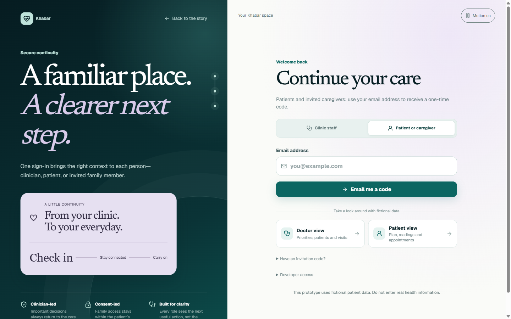
*Clinic staff sign in with email and password; patients and caregivers get a one-time email code (Supabase Auth). Invitation codes link a new sign-in to the right patient record. The two demo buttons are for reviewers.*

### 3. Doctor home: who needs you first
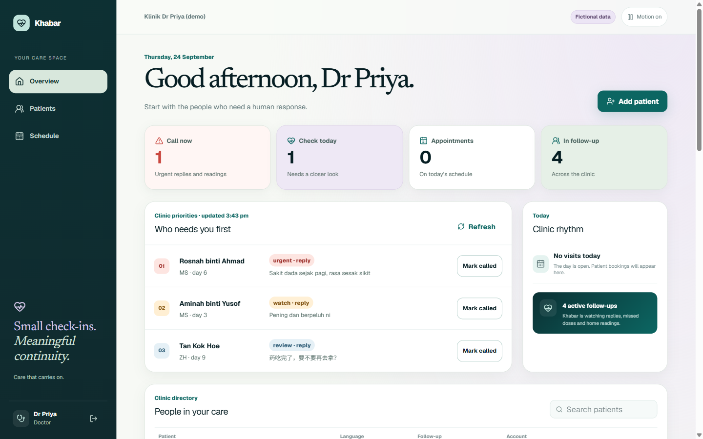
*The clinic's daily list, ranked by urgency: an urgent chest-pain reply in BM ("Sakit dada sejak pagi") comes first, then a dizziness reply, then a Chinese question about a repeat prescription. "Mark called" records that a person followed up.*

### 4. Patient record: the story before the consultation
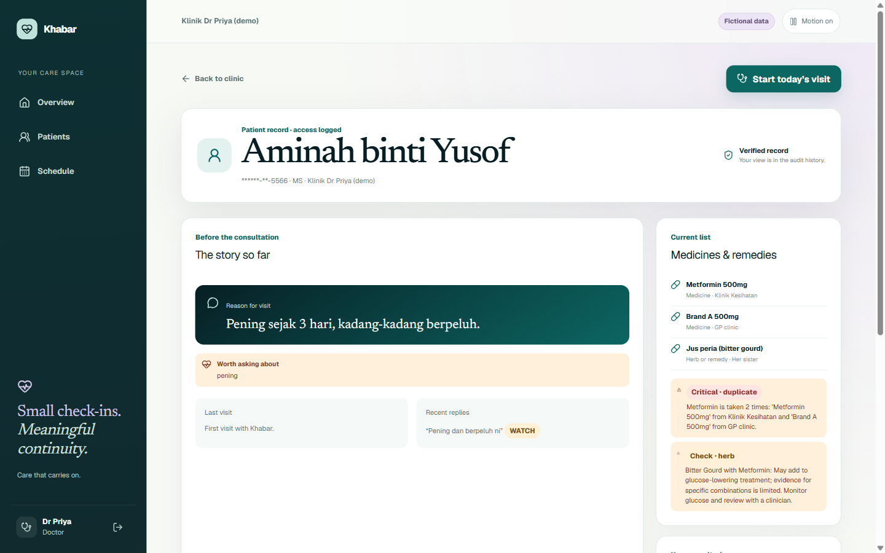
*Opening a record is itself logged ("access logged"). The pre-visit page shows the intake answer in her words, and a **critical duplicate**: metformin from the klinik kesihatan and "Brand A" from the GP are the same drug. Bitter-gourd juice is flagged as a herb check, with its evidence caveat.*

### 5. The visit: a safety gate the doctor cannot skip
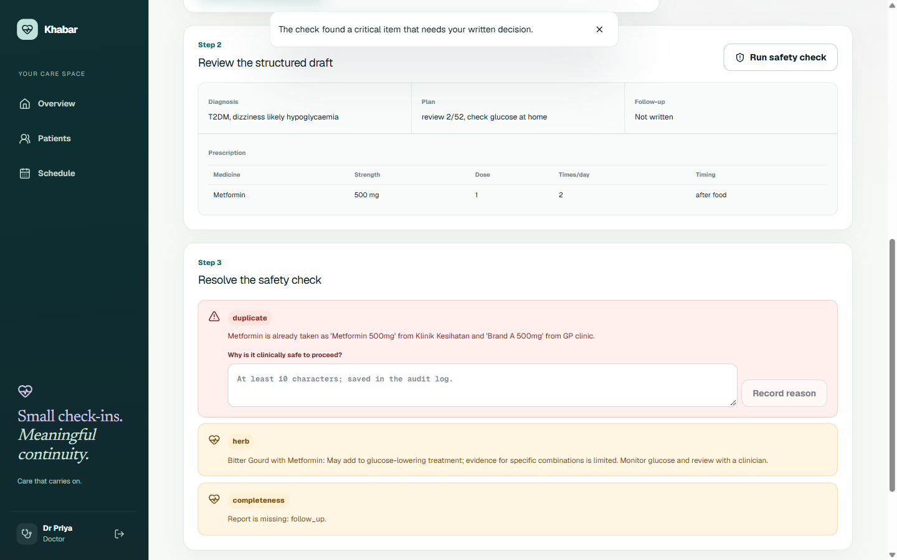
*The doctor's shorthand becomes a structured draft. The safety check then blocks finalising until the doctor writes why the duplicate is safe to proceed with. That reason goes into the audit log. The same rule is enforced again by the API and by a database constraint.*

### 6. Patient home (mobile): one place for the plan
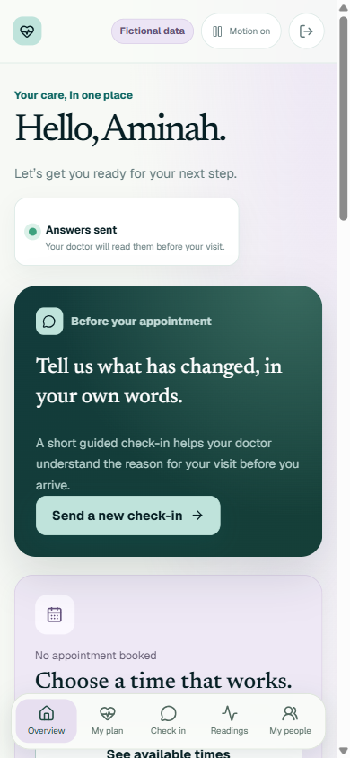

*Aminah's home on a phone: a guided check-in before the appointment, booking, readings, her shared medicine list and her caregivers, with a bottom navigation bar. Anything typed but not sent survives switching sections.*

### 7. A reply that raises a red flag
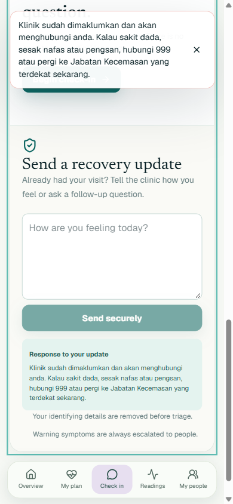

*She writes "Sakit dada sejak pagi, susah nak bernafas" (chest pain since morning, hard to breathe). Khabar does not improvise: it answers with fixed, pre-approved BM wording (the clinic has been told; call 999 or go to the nearest emergency department) and puts her at the top of the clinic's call list.*

---

## 4. What Makes It Different

| Feature | What's new, or the twist |
|---|---|
| **After the visit is the product** | Most clinic AI ends when the patient leaves. Khabar's value is days 1–30. |
| **Four languages, Malaysian style** | Summaries and triage in BM, English, Chinese and Tamil, including Manglish replies like *"pening sikit"*. |
| **Red-flag triage that errs towards alerting** | A reply is urgent if **either** a doctor-approved keyword list **or** the AI says so. The AI can raise urgency, never lower it. |
| **Patients only hear approved words** | Replies to patients come from three fixed sources: 999 advice for red flags, answers the doctor approved, or a plain acknowledgement. The AI never invents advice. |
| **"Everything I take," across clinics and cultures** | Cross-checks medicines from *other* clinics, local brand names, and **traditional remedies** (jamu, herbs, TCM) that patients rarely mention. |
| **Safety checks from data, not AI opinion** | Interactions come from **DDInter 2.0**, with written rules for allergies, doses, duplicates and herbs. The AI structures notes; it does not judge safety. |
| **A gate enforced three times** | A critical finding is blocked in the UI, the API **and** a database rule, so a bug in one layer can't let it through. |
| **Ramadan fasting mode** | Timings move to sahur and berbuka, and check-ins ask about low-blood-sugar symptoms. Doses stay the doctor's decision. |
| **"Who viewed my record"** | Patients can see who opened their data, which clinic software rarely offers. |
| **De-identified patient graph** | Neo4j holds each patient's medicines, herbs, conditions and visits under a random ID only. A test proves no name, IC or phone number can reach it. |

**Comparison with the solutions named in Section 1**

| | CliniFlow AI | Memora Health | PULIH (AstraZeneca) | **Khabar** |
|---|---|---|---|---|
| Clinic workflow (intake → report → safety) | ✅ | — | — | ✅ |
| Follow-up after the visit | One WhatsApp message | ✅ SMS, US | Medication reminders | ✅ 30 days, two-way |
| BM / Chinese / Tamil | — | — | — | ✅ |
| Red-flag alerts to the clinic | — | ✅ | — | ✅ |
| Traditional-medicine and other-clinic check | — | — | — | ✅ |
| Ramadan mode | — | — | — | ✅ |
| Patient-visible access log | — | — | — | ✅ |

*— = not mentioned in the public material we reviewed.*

---

## 5. Technical Architecture & Feasibility

### Tech stack

| Layer | Choice | Why we chose it | Constraints we expect |
|---|---|---|---|
| **Frontend** | **Next.js 16**, React 19, TypeScript. A web app that installs on phones. | One codebase for doctor, patient and caregiver. Reviewers open a link, with nothing to install. The camera works in the browser for packet photos. | No push notifications without a native app, so reminders go through WhatsApp instead. |
| **Clinical API** | **Spring Boot 3.3** (Java 21) | Strong typing and structure for clinical data, access checks and encryption. It is the only service that holds the encryption key and the only one that touches the database. | A steep learning curve for a first backend. Cold starts on serverless hosting (~15 s after idle). |
| **AI service** | **FastAPI + LangGraph** (Python) | Agents with explicit control flow: intake, report, evaluator, triage, summary, packet reader. Python has the best AI libraries. | A second language and service to deploy and secure (it only accepts calls signed with an internal service key). |
| **Database and sign-in** | **Supabase** (Postgres + Auth) | Free tier; built-in email one-time codes and passwords; managed Postgres. | Free projects pause when idle. Its built-in email only reaches team members, so real patient codes need a custom SMTP sender. The connection pool is small, so the API uses the transaction pooler. |
| **Patient graph** | **Neo4j AuraDB** (Free) | Multi-step questions ("which drug, from which clinic, clashes with which herb") are natural in a graph. Stores no names. | The free instance pauses when idle, and its password cannot be changed, so a leak means recreating it. The graph can be rebuilt from Postgres in one call. |
| **LLM** | **Google Gemini** (Flash), swappable in one setting | Low cost, multilingual, and it can read photos, so one provider covers text and packet images. | On the free tier Google may use the data, which is acceptable only because every record here is fictional. The final model is still to be chosen by the planted-error test. |
| **Transcription** | **Groq Whisper large-v3-turbo** | About US$0.04 per hour of audio; supports Malay and Tamil. | Accuracy on drug names in Manglish, still to be measured on five recordings. |
| **Messaging** | **WhatsApp Cloud API** | Where Malaysian patients already are. Webhook signatures are verified. | The test number reaches only 5 phones, and clinic-started messages need Meta-approved templates. Until then, messages go to a local outbox. |
| **Drug data** | **DDInter 2.0** subset + our own brand-name and herb tables | Free, peer-reviewed interaction data (70 pairs cover the demo medicines), with a reproducible import script. | Non-commercial licence (CC BY-NC-SA 4.0). Brand names are mapped by hand, and the herb list needs a pharmacist's review. Missing data is never treated as "safe". |
| **IoT (stretch)** | **Favoriot** | A Malaysian IoT platform with a REST API and per-device secrets. | Free tier unconfirmed, so the demo uses simulated readings. |
| **Hosting** | **Vercel**: `khabar-landing` for the web app; `khabar-api` in Singapore (`sin1`) running the API as a container and the agents as a Python service | Free tier, low latency from Malaysia, one place to deploy. A push to `main` that changes the web app is checked (lint, types) and deployed automatically by GitHub Actions. | Serverless cold starts, and the free Supabase and AuraDB tiers pause when idle. Before a live demo we warm everything up or move the API to an always-on host. |

### System architecture diagram
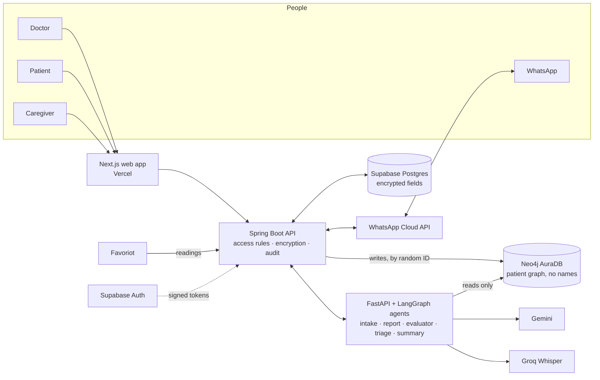

**Rules the architecture enforces**
1. **The agents never see identity.** Names, IC numbers and phone numbers are removed before any text reaches the AI, and the agents never touch Postgres.
2. **Only the API holds the encryption key.** IC, phone, notes, replies, summaries, intake chats, medication lists and booking reasons are encrypted in the database.
3. **Rules and data first, AI second.** Safety checks use DDInter and written rules wherever they exist.
4. **Critical findings are blocked three times:** in the UI, in the API, and by a database rule.
5. **Every token is checked.** Real Supabase sign-ins (ES256, against the project's published keys) and demo tokens (HS256) are each verified only against their own key, and must be unexpired and issued for this app.

### Build plan & scope
One builder, so the scope is tiered. **Tier 1 alone is a complete, demonstrable product.** If time runs short, features are dropped from the bottom up. The full day-by-day schedule and demo script are in [plan.md](plan.md).

| Tier | Scope | Status (24 Sep) |
|---|---|---|
| **Tier 1: committed** | Sign-in and access rules · intake chat and pre-visit page · AI report drafting · safety checks with the three-layer gate · multilingual summary · 30-day check-ins · two-way red-flag triage · clinic call list · de-identification · 30 fictional patients · demo clock | ✅ Built, tested and deployed |
| **Tier 2: planned** | Packet photo · caregiver access · Ramadan mode · field encryption · "who viewed my record" · self-booking · Neo4j graph | ✅ Built. Packet photos still need a real Gemini test. |
| **Tier 3: stretch** | Speaking instead of typing in the visit · Favoriot readings · voice-note summaries · learning each doctor's writing style | Speech-to-text and Favoriot are built (Favoriot with simulated readings). Voice notes and writing style are **not built** and are first to drop. |

**What's live, and what's left**

| Part | Done | Still to do |
|---|---|---|
| Sign-in and access | Doctor, patient and caregiver access rules; revoking caregiver consent blocks access at once; the API verifies real Supabase sign-ins and demo tokens | A real sign-in for each role on the live site; a custom SMTP sender for patient codes |
| Visit and safety | Notes or speech → structured draft; the ten-mistake planted-error set is a test, and all ten are caught | Pharmacist review of dose limits and herb evidence |
| Follow-up | Check-ins, four-language triage, approved-words-only replies, missed doses, home readings, the ranked call list | A live WhatsApp loop with approved templates; a real Favoriot device |
| Patient graph | Live on AuraDB with 31 fictional patients, read back by random ID only | Conditions appear once the live intake is run |
| Evidence | Automated tests and bug bash (below) | The planted-error comparison across LLMs; the transcription test; the 5-person understanding pilot |

---

## 6. Evidence it works

- **Local verification (25 Sep):** 226 API tests passed (including access rules, encryption, the safety gate, token checks and a real in-process Neo4j), with one optional PostgreSQL test skipped locally; 205 agent tests passed (including the planted-error set, triage in four languages, and Vercel-prefixed health route); frontend lint, TypeScript and production build passed. This branch has not been redeployed and rechecked on the public demo.
- **Bug bash (23 Sep):** 11 defects found and fixed, including one patient-safety issue: a reply confirmation that could be empty when triage was down now always includes 999 advice. See [docs/BUG_BASH_2026-09-23.md](docs/BUG_BASH_2026-09-23.md).
- **Deployed rehearsal (23 Sep):** pre-visit → draft → safety review → finalise → summary → follow-up reply → call list, run on the public URLs with demo sign-in.
- **Privacy test:** a test proves that no name, IC number or phone number can reach the Neo4j graph, and the live AuraDB instance was checked directly.
- **How we'll measure impact:** a 5-person understanding test comparing an English-only summary with a Khabar summary in the reader's own language (medicine, timing, warning sign). We'll report it honestly as a small pilot, not as proof.

---

## 7. Run it yourself

**Easiest:** open [khabar-landing-six.vercel.app](https://khabar-landing-six.vercel.app), press **Sign in**, then **Doctor view** or **Patient view**. The first load may take ~15 s while the API wakes up.

**Locally** (Java 21, Python 3.11+, Node 20+; no accounts needed):

```powershell
# API with 30 fictional patients and a clock you can fast-forward
cd services/api;    .\mvnw.cmd spring-boot:run "-Dspring-boot.run.profiles=local"
# Agents service
cd services/agents; .\.venv\Scripts\python.exe -m uvicorn main:app --port 8000
# Web app, then open http://localhost:3000
cd web;             npm install; npm run dev
```

Details, environment variables and tests: [services/README.md](services/README.md). The live API is browsable at [/docs](https://khabar-api.vercel.app/docs).

| Folder | What's in it |
|---|---|
| [web/](web/) | The Next.js app (deployed) |
| [services/api/](services/api/) | Spring Boot clinical API |
| [services/agents/](services/agents/) | FastAPI + LangGraph agents, DDInter subset and import script |
| [docs/](docs/) | Design notes, the daily [EXPLAIN.md](docs/EXPLAIN.md), bug bash, demo checklist, pitch scripts, earlier static screens |
| [plan.md](plan.md) · [UNDONE_WORK.md](UNDONE_WORK.md) · [FUTURE_PLAN.md](FUTURE_PLAN.md) | The plan, open work, and the product direction |

---

## 8. Credits & Declarations

- **Inspiration:** CliniFlow AI (UM Hackathon 2026 champion), for the clinic workflow and the safety-gate pattern. Khabar is a practice build ahead of SDC Hackathon 2026 and is **not** a competition entry.
- **Drug interaction data:** DDInter 2.0 (*Nucleic Acids Research*, 2025), licensed **CC BY-NC-SA 4.0**. The checker uses a generated subset for the demo medicines; see [import_ddinter.py](services/agents/scripts/import_ddinter.py) and [ddinter_interactions.json](services/agents/data/ddinter_interactions.json). Source: [DDInter downloads](https://ddinter.scbdd.com/download/). The non-commercial licence limits commercial use.
- **External services:** Google Gemini, Groq, Meta WhatsApp Cloud API, Supabase, Neo4j AuraDB, Vercel, Favoriot.
- **AI tools used in development:** Claude Code (Anthropic) for planning, research, the backend services and the web app; Google Antigravity for the earlier static screens in `docs/`. All AI-written code is reviewed, and explained in plain language in [docs/EXPLAIN.md](docs/EXPLAIN.md).
- **Data:** every patient in this repository and in the live demo is fictional. No real patient data is used or stored. Please don't enter real health information into the demo.
- **Not a medical device:** Khabar does not diagnose or treat. Every clinical decision stays with a clinician.

### Sources
[NHMS 2023 (CodeBlue)](https://codeblue.galencentre.org/2024/05/over-two-million-adults-in-malaysia-live-with-three-ncds-nhms-2023/) · [Malaysian health literacy](https://www.ncbi.nlm.nih.gov/pmc/articles/PMC8197907/) · [Medication adherence in Malaysia](https://pubmed.ncbi.nlm.nih.gov/42584433/) · [Polypharmacy in older Malaysians](https://journals.plos.org/plosone/article?id=10.1371%2Fjournal.pone.0173466) · [Traditional medicine & drug problems (meta-analysis)](https://pmc.ncbi.nlm.nih.gov/articles/PMC7996557/) · [Ramadan & diabetes in Malaysia](https://www.ncbi.nlm.nih.gov/pmc/articles/PMC3253336/) · [UNDP: older persons in Malaysia](https://www.undp.org/malaysia/blog/navigating-future-care-older-persons-malaysia-2040-community-support-technological-integration) · [Doctor workload (Focus Malaysia)](https://focusmalaysia.my/malaysias-healthcare-system-is-under-strain-and-reforms-cannot-wait/) · [AI vs professional translation of discharge instructions](https://pubmed.ncbi.nlm.nih.gov/40960827/) · [Bessemer: State of Health AI 2026](https://www.bvp.com/atlas/state-of-health-ai-2026) · [Memora Health](https://www.memorahealth.com/) · [PULIH by AstraZeneca](https://play.google.com/store/apps/details?id=com.astrazeneca.pulih&hl=en) · [DDInter 2.0](https://academic.oup.com/nar/article/53/D1/D1356/7740584)
