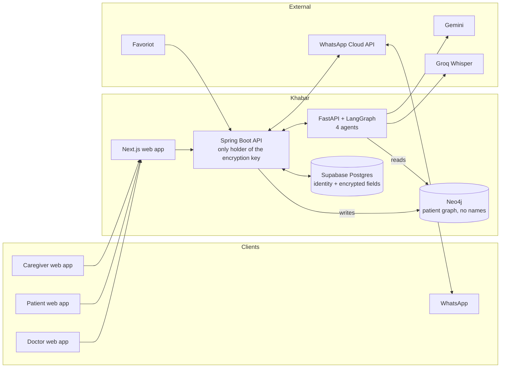

# Khabar — Implementation Plan

> **Apa khabar? · 你好吗? · நலமா?**
> AI aftercare for Malaysian clinics: patients understand their treatment in their own language, and the clinic knows who is slipping before they end up back in the queue.

*Inspired by CliniFlow AI (UM Hackathon 2026 champion). Khabar keeps its clinic workflow and adds what happens after the patient goes home.*

**Status:** practice build ahead of SDC Hackathon 2026. **Not** the competition entry. See §1.
**Builder:** solo · **Build window:** Tue 22 Sep – Mon 28 Sep 2026 (~12 h/day) · **Feature freeze:** Sun 11 Oct 2026

---

## 1. Context and ground rules

### Why this is practice, not the SDC entry
- SDC assigns each team's domain **at random**, and the two SDGs are unknown. There is no guarantee health is one of them.
- The real brief is released **Mon 19 Oct, 8:00 PM MYT**. The online round runs **19–25 Oct**.
- Handbook §7.4.1: the solution must be built *"primarily during the official hacking period"*.
- Handbook §8.2.1: any pre-existing code must be **declared at registration** and approved. Undeclared code risks point deductions.
- Handbook §8.5.6: the problem framing must come from the team, *"not from an AI-generated project idea"*.
- Handbook §8.5.3 / §8.5.7: judges can ask you to explain **any** part of the code, including AI-written parts.

### What carries into SDC
Only the **declared skeleton** (§12): five services wired together, logins, deployment, and the agent and checker pattern. No Khabar features. On 19 Oct you write a fresh idea from the real brief.

### Goals of this build
1. Learn to build a backend across all five pieces of the stack.
2. Rehearse shipping a working, deployed product, plus a pitch, alone.
3. Come out with a declarable skeleton that removes all setup time from SDC's 6-day online round.

---

## 2. The product

### The story
**CliniFlow stops at the WhatsApp message. Khabar starts there.** The before-visit and during-visit phases are the setup. The main story is the patient going home and the 30 days after.

### Why (Malaysian evidence)
| Problem | Evidence |
|---|---|
| Patients don't take their medicines | ~50% adherence among chronic-disease patients; **34%** for type 2 diabetes (meta-analysis) |
| Patients don't understand what they're told | **35%** of adults have limited health literacy (NHMS 2019); 68% of that group are older adults |
| Doctors have no time to explain | Understaffed public clinics see 80–100 patients a day per doctor |
| Care is fragmented | No integrated health record, so medicines from different clinics are never cross-checked |
| Traditional medicine is common and hidden | **69.4%** use traditional or complementary medicine; patients often don't tell their doctor |
| Many medicines at once | **46%** of urban older adults; supplements are a third of them |
| Families carry the care | **79.6%** of older Malaysians depend on their children |
| Ramadan risk | ~**90%** of Malaysians with type 2 diabetes fast; 24% of those on sulphonylureas had low-blood-sugar episodes (five-country study) |

### Users
- **Doctor** at an SME clinic (the paying customer)
- **Patient**
- **Family caregiver**, with the patient's consent

### Features
Priority: **P0** = never drop · **P1** = build this week · **P2** = first to drop. `★` = not in CliniFlow.

**Before the visit**
| ID | Feature | Priority |
|---|---|---|
| B1 | Self-booking from a rolling calendar | P1 |
| B2 | AI intake chat. It decides when intake is complete and personalises follow-up questions from the patient graph. | P0 |
| B3 | Pre-visit report for the doctor, with relevant history surfaced | P0 |
| B4 ★ | **"Show me everything you take":** photos of medicine packets from other clinics, supplements, jamu and TCM, turned into a reconciled medicine list | P1 |

**During the visit**
| ID | Feature | Priority |
|---|---|---|
| V1 | Doctor types notes, and the Report Agent drafts the report live | P0 |
| V2 | Doctor speaks instead of typing (transcription) | P2 |
| V3 | Safety review panel with 8 checks (§5) | P0 |
| V4 | Critical findings block finalising until the doctor writes a reason. Enforced in 3 places (§5). | P0 |
| V5 | Learns each doctor's writing style from their edits (style only, never medicine) | P2 |

**After the visit (the main story)**
| ID | Feature | Priority |
|---|---|---|
| A1 ★ | Plain-language summary in **BM, English, Chinese or Tamil**: medicines, times, doses, warning signs | P0 |
| A2 | Summary sent by WhatsApp | P0 |
| A3 ★ | Summary as a **voice note**, read aloud in the patient's language | P2 |
| A4 ★ | **Family caregiver access** with recorded consent | P1 |
| A5 ★ | **Ramadan fasting mode.** The doctor marks the patient as fasting and sets the timing. Reminders shift to sahur and berbuka, and check-ins ask about low-blood-sugar symptoms. The AI never changes doses. | P1 |

**Follow-up (days 1–30)**
| ID | Feature | Priority |
|---|---|---|
| F1 ★ | **30-day check-in plan** (day 1, 3, 7, 14, 30) over WhatsApp | P0 |
| F2 ★ | **Two-way replies with red-flag alerts.** Patient replies are triaged, red flags alert the clinic, and everything else gets doctor-approved answers only. | P0 |
| F3 ★ | **"Call these patients today" list** for the clinic, ranked by red flags, missed doses and no reply | P0 |
| F4 ★ | Blood-pressure and glucose readings via **Favoriot** (SDC sponsor), from a simulated device | P2 |

**Privacy (throughout)**
| ID | Feature | Priority |
|---|---|---|
| P1 ★ | Access rules: patients see only their own records; doctors see only their own patients; caregivers see only what was consented | P0 |
| P2 ★ | Field encryption of IC number, phone and doctor's notes | P1 |
| P3 ★ | No names or IC numbers sent to the AI | P0 |
| P4 ★ | **"Who viewed my record"** log, visible to the patient | P1 |

**Demo support**
| ID | Feature | Priority |
|---|---|---|
| D1 | Demo clock: fast-forward a patient's follow-up to day N | P0 |
| D2 | Generator for 30 fake Malaysian patients | P0 |

### If you fall behind, drop in this order
1. V5 writing-style learning
2. F4 Favoriot readings
3. A3 voice notes
4. V2 speaking instead of typing
5. A5 Ramadan mode
6. A4 caregiver access
7. P2 field encryption (keep P1, P3 and P4)
8. B4 photos, reduced to a typed medicine list

**Never drop:** B2, B3, V1, V3, V4, A1, A2, F1, F2, F3, P1, P3, D1, D2.

> This replaces the earlier drop order. Now that follow-up is the main story, F1–F3 can't be dropped without losing the pitch.

---

## 3. Architecture

### Rules the architecture enforces
1. **Spring Boot owns all clinical data** and is the only service holding the encryption key. Every access check, decryption and audit entry happens there.
2. **Neo4j stores no names.** It holds a random patient ID plus clinical facts, so the agents can query the graph directly for context (Graph-RAG) without ever seeing who the patient is. Spring Boot writes to Neo4j; the agents only read.
3. **The agents never touch Postgres.** They get anything else through Spring Boot's internal API, using a service token.
4. **Nothing sent to the LLM contains a name, IC number or phone number.** Enforced in one function in the agent service, with a test.
5. **Safety checks use data, not AI judgement,** wherever data exists (§5).

### Services
| Folder | Tech | Responsibility |
|---|---|---|
| `apps/web` | Next.js (App Router), installable web app | Doctor, patient, caregiver and clinic screens; demo clock |
| `services/api` | Spring Boot, Java 21+, domain-driven modules | Identity & Access, Patients, Scheduling, Encounters, Medications, Follow-up, Audit, Messaging |
| `services/agents` | Python, FastAPI + LangGraph | Intake, Report, Evaluator and Follow-up agents; photo reading; transcription; voice notes |
| `infra` | docker-compose, deployment config | Run all five locally with one command; deploy config per service |
| `data` | Python scripts | Fake-patient generator, DDInter subset, brand-name table, herb list, red-flag lists |
| `docs` | Markdown | `EXPLAIN.md`, demo script, test protocol |

### Agents (LangGraph)
| Agent | Job | Tools |
|---|---|---|
| **Intake** | Runs the pre-visit chat, asks about traditional medicine and supplements, accepts photos, decides when intake is complete, writes the pre-visit report | graph query, photo reader, brand-to-generic lookup |
| **Report** | Drafts the visit report from notes or transcript, handles doctor edits, writes the patient summary in the chosen language, produces voice-note text | graph query, transcription, text-to-speech |
| **Evaluator** | Runs the 8 checks on every draft and returns findings with a severity | interaction lookup, brand table, herb list, graph query |
| **Follow-up** | Schedules check-ins, interprets replies, triages red flags, answers only from the doctor-approved library, adjusts for Ramadan, reads Favoriot readings | red-flag lists, answer library, graph query |

---

## 4. Data

### Postgres (Supabase), key tables
`clinic`, `doctor`, `patient` (`name`, `ic_number_enc`, `phone_enc`, `preferred_language`, `graph_id`), `caregiver_link` (`consent_scope`, `consented_at`, `revoked_at`), `appointment`, `intake_session`, `encounter`, `report` (`status`, `doctor_notes_enc`), `safety_finding` (`validator`, `severity`, `detail`, `override_reason`, `overridden_by`), `prescription_item`, `med_inventory_item` (from photos), `followup_plan` (`fasting_mode`), `followup_message` (`direction`, `triage_level`), `approved_answer`, `alert`, `reading`, `audit_log` (`actor`, `patient_id`, `action`, `at`).

### Neo4j (no names)
- **Nodes:** `Patient{graph_id}`, `Condition`, `Medication{generic}`, `Brand`, `Allergy`, `Herb`, `Encounter`, `Symptom`, `Reading`
- **Relationships:** `HAS_CONDITION`, `TAKES{source_clinic}`, `ALLERGIC_TO`, `INTERACTS_WITH{severity}`, `BRAND_OF`, `REPORTED{at}`, `DUPLICATE_OF`

### Data sources
| Data | Source | Notes |
|---|---|---|
| Patients | Script generating ~30 Malaysian-style fake patients (Malay, Chinese, Indian and East Malaysian names; mixed languages; diabetes, hypertension, heart and kidney conditions; allergies; medicines from 2–3 clinics; some herbal use) | **No real patient data, ever** |
| Drug–drug interactions | **DDInter 2.0** (ddinter.scbdd.com) | CC BY-NC-SA 4.0: non-commercial only, **credit it in the README**. Cover only the drugs your fake patients take. |
| Brand to generic names | Hand-made table of ~50 drugs, checked against NPRA's QUEST3+ product search | No bulk download exists |
| Herb–drug interactions | Hand-curated list of ~20 herbs common in Malaysia, from published sources | Record the source for each row |
| Red flags | Doctor-style list per condition in BM, English, Chinese and Tamil | Example for low blood sugar: *pening, berpeluh, menggeletar* |

---

## 5. Safety design

### The 8 checks (Evaluator)
| # | Check | How | Blocking severity |
|---|---|---|---|
| 1 | Allergy | Graph: prescribed drug vs `ALLERGIC_TO` | CRITICAL |
| 2 | Drug–drug interaction | DDInter lookup on generic names | CRITICAL / WARN |
| 3 | Pregnancy | Patient flag vs drug category list | CRITICAL |
| 4 | Dose | Range table for the drugs in use | CRITICAL / WARN |
| 5 | Completeness | Required report fields present (rules) | WARN |
| 6 | Hallucination | Every claim in the draft must trace back to the transcript, notes or graph; anything untraceable is flagged (LLM-assisted, with evidence attached) | WARN / CRITICAL |
| 7 ★ | Duplicate medicine | Same generic from another clinic (photo list) | CRITICAL / WARN |
| 8 ★ | Herb–drug | Curated herb list vs prescription | WARN / CRITICAL |

### The critical-finding block, enforced in 3 places
1. **UI:** the finalise button is disabled while an unacknowledged CRITICAL finding exists.
2. **API:** Spring Boot refuses to finalise without an `override_reason` for every CRITICAL finding.
3. **Database:** a constraint or trigger rejects `report.status = FINAL` while any CRITICAL finding lacks an override reason.

Every override is audited per finding.

### Follow-up safety
- **Triage errs towards alerting.** A reply is a red flag if **either** the keyword list **or** the AI classifier says so.
- **The AI never gives new medical advice.** Non-urgent replies get a doctor-approved answer, or "the clinic will contact you".
- **Ramadan mode only re-times reminders the doctor set.** Dose changes are the doctor's job.

### How the checker is tested
**Planted-error set:** 10 draft reports with known errors (allergy clash, double dose, duplicate from another clinic, herb clash, invented symptom, and so on).
- The checker must catch all CRITICAL ones.
- Run the set on two LLMs and keep whichever catches more. This decides the final LLM choice (§7).

---

## 6. Privacy and security
- **Logins:** Supabase handles them. Patients and caregivers sign in with a one-time code by email; doctors use email and password. Spring Boot checks the Supabase token on every request.
- **Access rules** live in Spring Boot, with Supabase row-level security as a second lock.
- **Field encryption:** Spring Boot encrypts sensitive fields with AES-256-GCM. The key is a hosting environment variable and **never** stored in the database. Don't use Supabase's pgsodium column encryption (pending deprecation).
- **Protection by layer:** Supabase encrypts its disks by default; field encryption also covers a leaked database dump.
- **Before anything goes to the LLM,** names, IC numbers and phone numbers are removed, and the AI sees only the graph ID.
- **"Who viewed my record":** every read of a patient's record by a doctor, caregiver or the system writes to `audit_log`, and the patient can see it.
- **Consent:** caregiver access is scoped (summary only, or summary plus alerts), timestamped and revocable.
- **Data:** fake patients only. Real health data is "sensitive personal data" under Malaysia's PDPA 2010.

---

## 7. Tech choices and accounts
| Need | Choice | Cost | Note |
|---|---|---|---|
| LLM | **Gemini**, free tier to start, swappable through LangChain | Free, then pay per use | Free-tier data may be used by Google. Fine for fake patients. Confirm the choice with the planted-error test. |
| Transcription | **Groq Whisper large-v3-turbo** | ~US$0.04 per hour of audio | 1-hour test against Gemini Flash-Lite and `gpt-4o-mini-transcribe`, counting drug-name errors in 5 Manglish recordings. Behind one function. |
| Voice notes (text-to-speech) | Decide in the test | Cents | **Test Tamil and Chinese quality first** |
| WhatsApp | **WhatsApp Cloud API** test number | Free, up to 5 verified phones | Check-ins and summaries start from the business side, so they need **message templates approved by Meta**. Submit them on day 2. |
| WhatsApp fallback | Telegram Bot API | Free | Switch if Meta's setup blocks you for more than half a day |
| IoT | Favoriot | Free tier unknown | Check on day 0. If it's paid, simulate the readings and move F4 to the pitch's "what's next" slide. |
| Web hosting | Vercel | Free | |
| Spring Boot and FastAPI hosting | Any container host (Render, Railway or Fly.io) | Free while building, ~US$5–15/month from a week before demos | Singapore region. Free tiers go to sleep, so avoid them for demos. |
| Database and logins | Supabase | Free | Singapore region |
| Graph database | Neo4j AuraDB Free | Free | Pauses when idle, so wake it before demos |
| Interaction data | DDInter 2.0 | Free (non-commercial) | Credit it |

---

## 8. Schedule

### Week 1: build everything (Tue 22 – Mon 28 Sep, ~12 h/day)
| Day | Goal | Done when |
|---|---|---|
| **Mon 21 (tonight)** | Accounts: GitHub, Supabase, AuraDB, Gemini, Groq, Meta developer app with WhatsApp test number, Vercel, container host, Favoriot. Send the organiser email. | Every key is in a local `.env`, nothing committed |
| **Tue 22** | Folder structure; all 5 pieces running locally with docker-compose; Supabase logins working end to end | A doctor logs in, and Spring Boot sees the verified user |
| **Wed 23** | **Thin slice:** book appointment → Spring Boot → Postgres → one Neo4j node → FastAPI agent answers one intake question via Gemini → shown in Next.js. **Deploy all 5.** Submit WhatsApp templates. | It works on the deployed URLs, not just localhost |
| **Thu 24 ✅ CHECKPOINT** | Access rules, field encryption, audit log, name stripping before the AI; fake-patient generator; DDInter subset, brand table, herb list, red-flag lists loaded | **If the thin slice isn't deployed tonight, start the drop order.** |
| **Fri 25** | Before the visit: B1 booking, B2 intake agent, B3 pre-visit report, B4 photo check | A fake patient completes intake with photos, and the doctor sees the report |
| **Sat 26 ✅ CHECKPOINT** | During the visit: V1 report agent, V3 all 8 checks, V4 block in 3 places, planted-error test set, V2 transcription | **The core loop works deployed.** Otherwise start the drop order. |
| **Sun 27** | After the visit: A1 multilingual summary, A2 WhatsApp, A4 caregiver consent, A5 Ramadan mode, P4 "who viewed my record", A3 voice notes | The patient and caregiver phones receive the BM summary |
| **Mon 28 🎯 TARGET** | Follow-up: F1 check-in plan, F2 two-way triage, F3 call list, D1 demo clock, F4 Favoriot, V5 style learning | The full demo script (§10) runs end to end |

> **Honest note:** this is very tight for a first backend across five services. The checkpoints exist so slipping is a decision, not a surprise.

### Buffer (Tue 29 Sep – Sun 4 Oct)
Overflow from week 1 **only, no new features.** If week 1 finishes on time, use this for hardening and tests.

### Protected (Mon 5 – Sun 11 Oct)
| Day | Work |
|---|---|
| Mon 5 – Tue 6 | Bug bash; prepare the demo data; switch hosting to paid tiers so nothing sleeps |
| Wed 7 | **Patient-understanding test** with 5 people (§10) |
| Thu 8 – Fri 9 | Pitch deck (5-minute core, plus 3- and 7-minute versions); record the demo video; watch it back and cut |
| Sat 10 | Cut down to the skeleton (§12); write the declaration text |
| **Sun 11** | **Feature freeze. Classes restart.** |

### Before SDC
- **By Fri 16 Oct:** register with the skeleton declared. Register earlier if the organisers confirm the declaration can be updated.
- **Sat 17 – Sun 18 Oct:** rest.
- **Mon 19 Oct, 8 PM:** SDC brief is released. Write a fresh idea from it.

---

## 9. Daily habits
- **`docs/EXPLAIN.md`, 15 minutes every night:** in your own words, what the code merged today does and why. This is your defence for §8.5.7, and it becomes your SDC documentation.
- Commit at least at every checkpoint, with meaningful messages.
- Never commit `.env` files, keys or real data.

---

## 10. Demo and headline number

### Demo script (story: after the visit)
**Mak Cik Aminah, 67.** Type 2 diabetes and hypertension. Prefers BM. Her daughter works in KL.
1. **Intake (short):** she mentions herbal tea from a relative and photographs her packets. Khabar finds metformin from the klinik kesihatan **and** from the GP under another brand, plus an herb clash.
2. **Visit:** the doctor dictates. The checker flags a CRITICAL duplicate. The doctor must type a reason before finalising.
3. **Going home:** a BM summary and voice note on WhatsApp. Her daughter gets the summary too (consented).
4. **Ramadan:** reminders shown as *sahur / berbuka*.
5. **Day 3 (demo clock):** Aminah replies *"pening dan berpeluh"* ("dizzy and sweating"). Red flag for low blood sugar. She jumps to the top of the clinic's call list, and the doctor calls her.
6. **Trust:** Aminah opens "who viewed my record".

### Headline number: the patient-understanding test
- **5 people** (family and friends), each in their preferred language.
- Each person reads **case A** as an English-only summary and **case B** as a Khabar summary. Swap which case gets which format for half the people.
- **3 questions per case:** Which medicine, when? What dose? Which symptom means go back to the clinic?
- **Report:** correct answers, English-only vs Khabar. Present it honestly as a 5-person pilot.

---

## 11. Going public
- README credit: *"Inspired by CliniFlow AI (UM Hackathon 2026 champion)."*
- README credit: *"Drug interaction data: DDInter 2.0 (CC BY-NC-SA 4.0)."*
- State clearly: **fake data only; not a medical device; not for clinical use.**
- Check that the `khabar` domain and GitHub name are free before announcing.

---

## 12. The declared skeleton (for SDC)

**Goes in** (a separate repository, not Khabar):
- The 5 pieces wired together with docker-compose
- Supabase logins verified in Spring Boot
- Service token between Spring Boot and FastAPI
- A LangGraph starter: one example agent plus a checker node
- Encryption and audit-log utilities
- Name-stripping function with its test
- Deployment config for each service

**Stays out:** every Khabar feature, prompt, data file, screen and name.

**Declaration draft:** *"We will build on a personal starter template created before the event: a multi-service project skeleton (Next.js, Spring Boot, FastAPI with LangGraph, Supabase, Neo4j) providing authentication, service wiring, deployment configuration and generic security utilities. It contains no domain-specific features. Repository: <link>."*

---

## 13. Open items
- [ ] Organisers' answers: which SDGs, whether the declaration can be updated, pitch length, judging weights
- [ ] **Parked:** hours available during SDC week (19–25 Oct) alongside classes
- [ ] Final LLM choice, from the planted-error test
- [ ] Transcription choice, from the 1-hour test
- [ ] Voice-note quality in Tamil and Chinese
- [ ] Whether Favoriot has a free tier
- [ ] WhatsApp template approvals

---

## 14. Decisions log (from the planning session, 21 Sep 2026)
| Decision | Choice |
|---|---|
| Role of this build | Practice; fresh idea at SDC; declared skeleton only |
| Relationship to CliniFlow | Borrow its patterns; main story is after the visit (credited) |
| Scope | All three phases + all twists + all 7 extra ideas, this week |
| Stack | Next.js, Spring Boot, FastAPI + LangGraph, Supabase, Neo4j (first backend) |
| Web or mobile | Web app, installable on phones |
| Team | Solo |
| AI coding | AI writes, you review, plus nightly `EXPLAIN.md` |
| Build order | Thin slice across all 5 pieces first, deployed |
| Hosting | Free while building, paid before demos |
| Data | Fake patients only |
| Drug data | DDInter 2.0 + brand table + herb list |
| Privacy | Layered: access rules, field encryption, name stripping, audit log |
| Patient login | One-time code by email |
| WhatsApp | Cloud API test number, Telegram fallback |
| LLM | Gemini free tier, swappable (accepted by default; confirm with the test) |
| Transcription | Groq Whisper turbo + 1-hour test (accepted by default) |
| Headline number | Patient-understanding test |
| Pitch | 5-minute core, with 3- and 7-minute versions |
| Name | **Khabar** |

---

### Sources
[SDC Handbook](https://sdchack.my/legal/handbook-2026-08-17.pdf) · [NHMS 2023 (CodeBlue)](https://codeblue.galencentre.org/2024/05/over-two-million-adults-in-malaysia-live-with-three-ncds-nhms-2023/) · [Malaysian health literacy](https://www.ncbi.nlm.nih.gov/pmc/articles/PMC8197907/) · [Medication adherence, Johor](https://pubmed.ncbi.nlm.nih.gov/42584433/) · [Polypharmacy in older Malaysians](https://journals.plos.org/plosone/article?id=10.1371%2Fjournal.pone.0173466) · [Traditional medicine & drug problems (meta-analysis)](https://pmc.ncbi.nlm.nih.gov/articles/PMC7996557/) · [Ramadan & diabetes, Malaysia](https://www.ncbi.nlm.nih.gov/pmc/articles/PMC3253336/) · [Hypoglycaemia during Ramadan, five-country study](https://pubmed.ncbi.nlm.nih.gov/21506631/) · [UNDP: older persons in Malaysia](https://www.undp.org/malaysia/blog/navigating-future-care-older-persons-malaysia-2040-community-support-technological-integration) · [Doctor workload (Focus Malaysia)](https://focusmalaysia.my/malaysias-healthcare-system-is-under-strain-and-reforms-cannot-wait/) · [DDInter 2.0](https://academic.oup.com/nar/article/53/D1/D1356/7740584) · [WhatsApp Cloud API](https://developers.facebook.com/docs/whatsapp/cloud-api/get-started/) · [Supabase pgsodium deprecation](https://supabase.com/docs/guides/database/extensions/pgsodium) · [Memora Health](https://www.memorahealth.com/)
